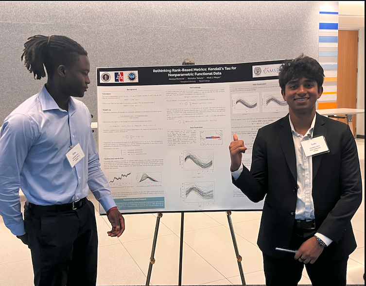
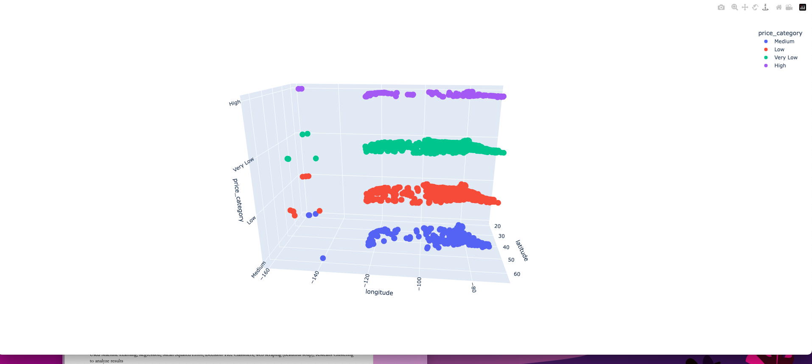
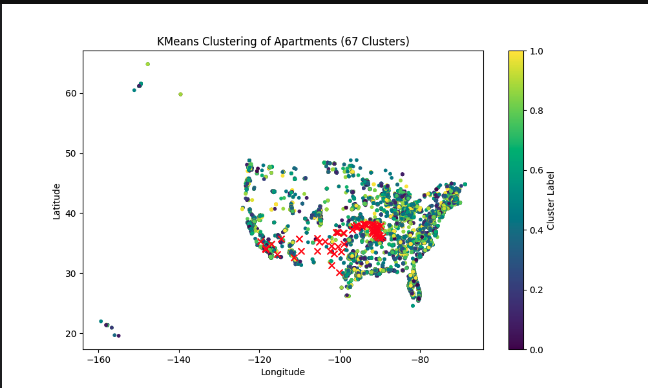
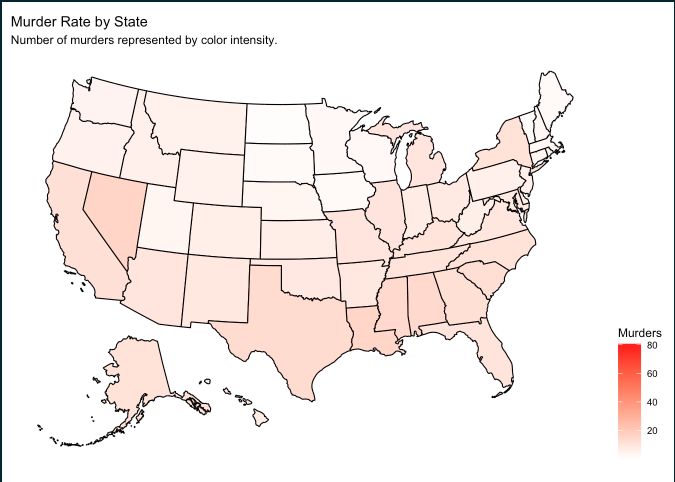
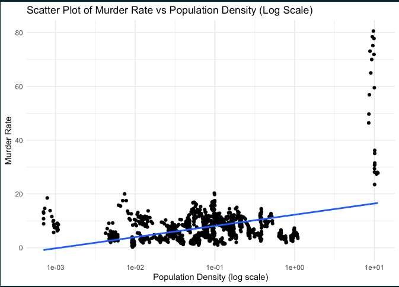
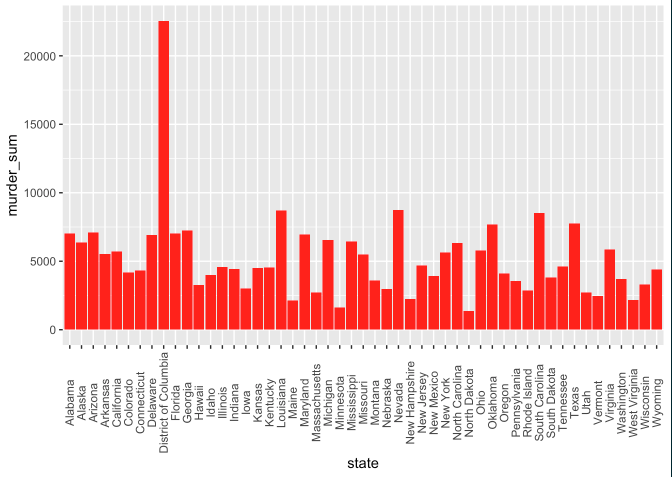

<!-- Cool Gradient Background Header -->
<h1 align="center" style="font-family: 'Segoe UI', Tahoma, Geneva, Verdana, sans-serif; background: linear-gradient(to right, #00c6ff, #0072ff); color: white; padding: 20px; border-radius: 15px;">👋 Hi! Welcome to my GitHub!</h1>

<!-- Profile Summary -->

    I'm a passionate Data Science major with a minor in International Business, currently studying at American University and London School of Economics. My expertise lies in predictive analytics, machine learning, and data visualization. Check out my projects and experience below!

<!-- Contact and LinkedIn -->

    📧 <a href="mailto:rs5309a@student.american.edu" style="color: #0072ff; text-decoration: none;"><strong>Contact Me</strong></a> |
    🌐 <a href="https://www.linkedin.com/in/rishi-siddharth-0024ba235/" style="color: #0072ff; text-decoration: none;"><strong>LinkedIn</strong></a>

<!-- Profile Image -->

    

<!-- Education Section -->
<h2 style="font-family: 'Courier New', Courier, monospace; color: #0072ff;">🎓 Education</h2>
<ul style="font-size: 1.1em;">
    <li><strong>American University</strong>, Graduating 2026</li>
    <li><strong>London School of Economics</strong>, 2024-2025 (Junior Year)</li>
    <li>Data Science major, International Business minor</li>
</ul>

<!-- About Me Section with Gradient Background -->
<h2 style="font-family: 'Courier New', Courier, monospace; color: #0072ff;">🏅 About Me!</h2>

    I still manage to have fun outside of work. I love soccer, and still currently play on the club team at AU where I am a D1 practice player for the women's team as well.

<!-- Work Experience Section -->
<h2 style="font-family: 'Courier New', Courier, monospace; color: #0072ff;">💼 Relevant Work Experience</h2>

    <strong>Research Intern - Georgetown University</strong> (May - August 2024)  
    Spatial Program: Participated in research projects funded by the NSA and NSF. Focused on building a predictive stock portfolio analytic model using time series and web scraping.

    <strong>Summer Technology Helper - Menlo Park School District</strong> (Jun 2023 - Aug 2023)  
    Managed quality maintenance for iPads and integrated software using JSON server.

<!-- Technical Skills with Icons and Badges -->
<h2 style="font-family: 'Courier New', Courier, monospace; color: #0072ff;">🛠️ Technical Skills</h2>

    <!-- Skills Badges -->
    
    
    
    

<!-- Currently Learning Section -->

    <strong>Currently Learning:</strong>  
    
    
    

<!-- Connect with Me Section -->
<h2 style="font-family: 'Courier New', Courier, monospace; color: #0072ff;">🚀 Let's Connect!</h2>

    I'm always open to discussing new projects, collaborations, or job opportunities. Feel free to <a href="mailto:rs5309a@student.american.edu" style="color: #0072ff; text-decoration: none;"><strong>contact me</strong></a> or connect with me on <a href="https://www.linkedin.com/in/rishi-siddharth-0024ba235/" style="color: #0072ff; text-decoration: none;"><strong>LinkedIn</strong></a>.

# MORE PROJECTS COMING SOON!

# [Project 0 - Stock Insight Analytic Tool]

This a comprehensive stock portfolio analytic tool that gives new users to the stock market an insight into the factors that actually affect a stock.

# Steps

1. We were able to source data, 128 stocks, that ranged from stocks within the AI/fintech sector to bonds and mutual funds, all from the yahoo finance library on python.

2. We were able to obtain 3 scores;
    a. Raw Total Score =  all the factors of a stock summed up
    b. Total Score =  The score of this was based on each factor being divided by the maximum amount out of all the stocks. For example, if the PE_SCORE minimum was -4.9, the absolute value of that would be added to each PE_SCORE for every stock. We would do this to eliminate all negative values. Then, we divided each columnn values by the maximum to create a scale of 0-1.
   c. Normalized Total Score = We simply took the Total Score and created a more reasonable scaling. It ranged from -100 to 100.

4. Using the scores we were able to determine statistical outcomes when comparing to the factors that affected a stock.

5. Results = 

# [Project 1 - US Apartments](https://github.com/Rsiddharth54/U.S-Apartments-Project)
Abstract ----
The purpose of this project was to learn the basics of machine learning and to implement new data visualization techinques I wanted to play around with more. The dataset that featured US Apartments and their characteristics was a useful way to learn and utilize these concepts.

- Dataset involving apartments all over the U.S 
- Data cleaning, data manipulation
- Linear regression, mean sqaured error, and decision tree classifiers 
- Data visuals such as Matplotlib, confusion matric display, and the use of another dataset for accuracy comparison purposes

# [Project 2 - Violence in America](https://drive.google.com/file/d/1nDogpm4zgvAgjSiDvB5WUJTseWvjF-h3/view?usp=drive_link)

Abtract --------------------
With this project I wanted to utlize new concepts learned in R. This was my first project, and I wanted to maintain the skills used in this project, so I turned it into a lesson of some sort. With everything I did; from data cleaning, maniupulation, graphics, and statiscal tests I documented how I did it, why, and analyzed every output. I got some great insights from a great dataset that consisted of America's crime: violence, robbery, and murder plus demographics, age, race, etc. 

- Dataset that consisted of violence in America, split by murder, violence, robbery etc.
- Conducted in Rstudio
- Data manipulation, data cleaning,  (forcats, lubridate, ggplot, dplyr).
- Summary Statistics, data visualization, linear regression
- Spearman's rank, ANOVA, clear concise explaination of results

USAfacts.org posted an article on November 8, 2023, which showed the highest murder rates. In their article, they state “Although Washington, DC, had a higher homicide death rate (33.3 homicide deaths per 100,000 people) than every state, it’s not a state — given its population density, a fairer comparison is to counties in major metropolitan areas.” This is exactly what our data showed, which, like the article states, is somewhat of an unfair compariosn due to it’s population density.

https://usafacts.org/articles/which-states-have-the-highest-murder-rates/

## 🚀 Let's Connect!
I'm always open to discussing new projects, collaborations, or job opportunities. Feel free to [contact me](mailto:rs5309a@student.american.edu) or connect with me on [LinkedIn](https://www.linkedin.com/in/rishi-siddharth-0024ba235/).

Thank you for visiting my GitHub profile!

